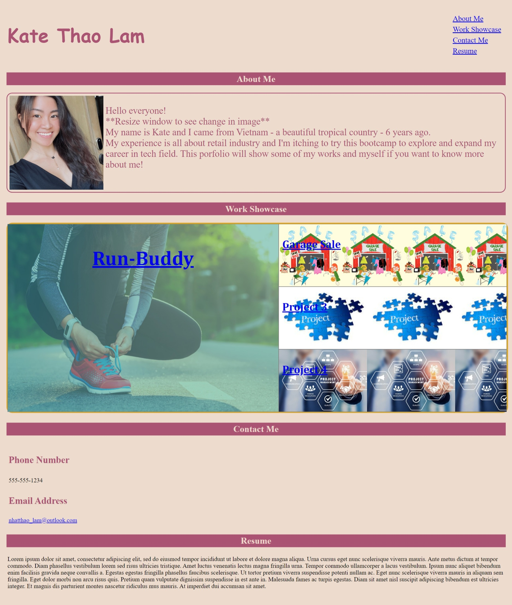

# Kate-Portfolio Challenge

Deployed URL:
https://kate-github.github.io/Kate-portfolio/

Screenshot of Deployed Application

## Criteria:

A portfolio challenge which include:

- Name, recent photo and navigation links about myself, my work and contact.

- Some essential Advanced CSS skills that recently covered in the class such as :Flexbox, Pseudo Class, Media Queries and CSS Variables.

- When clicking on the menu about my work, it navigates to my applications with images, links and the first image will be larger than the others.